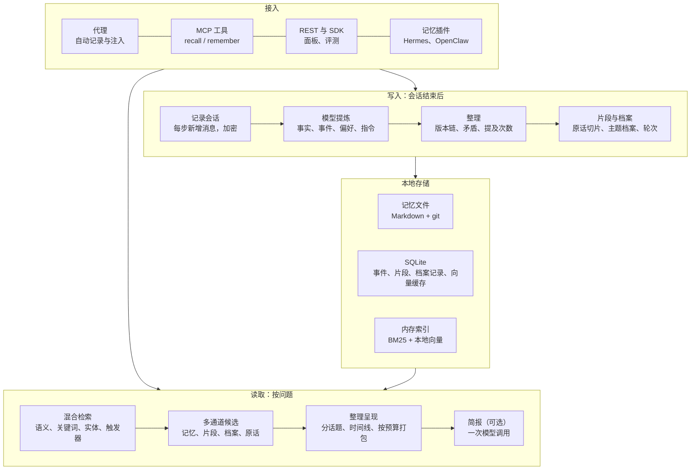

# ctx 说明文档（v0.5，2026-10-02）

ctx 是一个本地长期记忆引擎：让 AI Agent 和个人助理跨会话记住东西——项目的命令和约定、踩过的坑、用户的偏好和长期要求、生活和工作中发生过的事。它是一个 Rust 单二进制程序，数据只存在本机。

本文是总的说明：它做什么、怎么接入和使用、内部怎么工作、目前测出来有多好、哪些功能默认关闭以及为什么。更细的设计见 [architecture.md](architecture.md)，所有实验数据见 [benchmark-results.md](benchmark-results.md)。

## 1. 目前的水平

| 测评 | ctx | 参照 |
|---|---|---|
| BEAM 100K（20 段长对话、400 题、10 种能力；答题与评判均为 gemini-3.8-flash-high） | **67.2%**（8k 预算 + 简报） | 只把标注的正确原文交给答题模型：51.0%；参考答案本身：94.8%；Hindsight 自报 73.4%（评判模型不同） |
| LongMemEval，20 道新题（2k 预算，两遍） | **20/20、20/20** | Mem0 OSS 2.2.1：18/20、18/20；提炼 token 约为 ctx 的 3 倍 |
| 同一批记忆文本上的检索（B1） | Recall@3 93.5% | 朴素向量检索 96.0%（但对无关问题和其他项目也总是返回内容；ctx 40 题中只返回 3 次和 1 次） |

BEAM 上剩下的错误，按“第一个出错的环节”分：材料里没有 5.9 个百分点，材料有、简报没写对 18.2，简报对了、回答丢了 4.4，评分 3.0。也就是说，主要瓶颈在把材料整理成答案的那一步，不在检索（详见 benchmark-results.md 的“错题分类”）。

## 2. 架构总览



- **接入**：四种方式等价，选一种即可（代理和插件不要同时启用）。
- **写入**：会话空闲（默认 10 分钟）或收到 `task_end` / `session_end` 后提炼。
- **读取**：两种模式——代理自动注入（`inject`，少而准）和主动检索（`search`，多而全，可选简报）。
- **存储**：记忆是可读可改的 Markdown 文件，由独立 git 仓库记录每次修改；其余在一个 SQLite 文件里；索引常驻内存。

## 3. 安装与接入

```bash
cargo build --release
./target/release/ctx init
./target/release/ctx model set https://YOUR-GATEWAY/v1 YOUR-MODEL --credential-ref keychain:ctx-llm
./target/release/ctx connect claude-code     # 也可以 codex、openclaw，或 ctx connect AGENT UPSTREAM_URL
./target/release/ctx doctor --llm
./target/release/ctx open                    # 本地面板
```

- `model set` 配置提炼、简报等用的模型；不配置时仍可手动记忆和检索。凭证只以引用形式保存（`keychain:SERVICE` 或 `env:NAME`），不会写进配置文件。
- 语义模型（EmbeddingGemma 300M 量化版，约 330 MB）首次使用时下载到 `~/.cache/ctx/models`，之后离线运行，单次查询约 50 ms；下载失败时退回关键词检索。
- macOS 默认把状态放在 `~/.ctx`，用 launchd 常驻。`CTX_HOME=/some/path` 建立隔离实例（不装服务、不改 shell 配置），适合测试。
- 代理地址 `http://127.0.0.1:7788/a/AGENT/v1`，请求带 `X-Ctx-Token`（值在 `~/.ctx/token`）。支持 OpenAI Chat Completions、Responses 和 Anthropic Messages，含流式。
- 插件接入：Hermes 用 [`integrations/hermes/ctx`](../integrations/hermes/ctx/README.md)，OpenClaw 用 [`integrations/openclaw/ctx-memory`](../integrations/openclaw/ctx-memory/README.md)。SDK：`sdk/python`、`sdk/typescript`。

项目自动识别：代理从 Agent 提示词里的工作目录取 git 仓库名，MCP 用启动目录，也可以用 `X-Ctx-Project` 请求头或 `/a/AGENT/p/PROJECT/v1` 路由指定。项目记忆只在该项目出现，`global` 记忆处处可见。

## 4. 日常使用

### 命令行

```bash
ctx remember '部署 payments 前先执行 make migrate' --type lesson --scope payments
ctx remember '回答一律用中文' --type rule        # 规则：始终放进系统提示
ctx recall '部署前要做什么'                       # 默认以当前仓库为项目
ctx memories                                      # 列出记忆
ctx edit mem_... '新的内容'
ctx forget mem_...                                # 归档（不删除）
ctx review mem_... approve                        # 批准 Agent 提议的规则
ctx sessions                                      # 会话与提炼状态
ctx extract --session KEY                         # 立即提炼某个会话
ctx reindex                                       # 补算向量、补建片段、重建档案
ctx status
```

触发器让某条记忆在确定情形下必定出现：`--trigger keyword:TEXT`、`error:TEXT`、`tool:NAME`、`file:GLOB`。

### MCP 工具

| 工具 | 作用 |
|---|---|
| `recall` | 检索长期记忆；`deep: true` 时先把问题拆成子查询（多一次模型调用） |
| `remember` | 保存一条记忆（`fact` / `lesson` / `skill`，`project` 或 `global`） |
| `forget` | 归档一条错误或过时的记忆 |
| `expand` | 按 id 读取记忆或被折叠的工具输出 |

`mcp_tools: full` 时另有 `flag_memory`（标记错误或过时）和 `set_intent`（提议一条将来的动作，等你审核）。

### REST 检索

`GET /api/v1/recall?q=...&project=...`，请求头 `X-Ctx-Token`。常用参数：

| 参数 | 说明 |
|---|---|
| `mode` | `search`（默认，按相关度返回前 `limit` 条）或 `inject`（代理用的少而准） |
| `limit` / `episodes` | 返回条数（最多 50）/ 附带的原始对话片段数 |
| `budget` | 按读者的 token 预算打包：记忆在前，片段只保留相关部分，放不下的整条跳过 |
| `brief=true` | 先宽松取回约 2 万 token 材料，用一次模型调用写成针对问题的简报，放在结果最前面 |
| `dry_run=true` | 与 `brief` 同用：只返回简报会读的材料，不调用模型（检查检索用） |
| `deep=true` | 先把问题拆成最多 4 个子查询和日期窗口，再分别检索 |
| `now` | 相对日期（“上周”）的基准日期 |
| `turns=true` | 附上用户原话记录（简报模式总会读取） |
| `agent=true` | 与 `brief` 同用：写简报前允许多轮查找（试验功能） |

其他接口：`POST /api/v1/memories`（写入）、`POST /api/v1/sessions/ingest` 和 `/sessions/{key}/extract`（导入并提炼一段对话，评测用）、`GET /api/v1/stats`、`GET /api/v1/status`。

## 5. 记忆是什么样的

每条记忆是 `~/.ctx/memory/` 下的一个 Markdown 文件（YAML 头 + 正文）。主要字段：`id, type, title, scope, status, source, pinned, confidence, triggers, expires, supersedes, superseded_by, evidence, observed_at, event_at, topics, entities, mentioned_at`。

| 类型 | 含义 |
|---|---|
| `fact` | 关于用户或项目的事实；发生或计划的事也是 `fact`，另带事件日期 `event_at` |
| `lesson` / `skill` | 教训、做法（编码 Agent） |
| `preference` | 用户的口味和要求，用于以后推荐 |
| `instruction` | 用户对助手回答方式的长期要求，检索时总放在最前面 |
| `rule` | 始终生效，进系统提示；只能由你创建或批准 |
| `intent` | 将来的动作，需你审核 |
| 派生类型 | `summary`（每个会话一条摘要）、`digest`（话题摘要）、`dossier`（主题档案）、`reflection`、`narrative`（后两者默认关闭）；由 ctx 生成，只供检索 |

`source` 是 `user`（你说的）、`agent`（Agent 或提炼器推断）或 `observed`。只有 `source: user` 的规则会生效；自动提炼永远不会自动启用规则。

## 6. 写入：一段对话之后发生什么

1. **记录**：代理或插件按会话保存每步新增的消息和回复（AES-GCM 加密），游标保证守护进程重启后不重复记录。
2. **提炼**：把脱敏后的对话（用户消息全部保留，工具输出优先裁剪，最多 3 万字）和召回到的相关旧记忆交给模型，模型返回新建、更新、取代、再次提及或跳过。编码 Agent 和个人助理用两套提示词（`extraction.general_agents`）。每个会话最多采用 40 条。
3. **整理**：
   - **版本链**：值变了（预算从 500 提到 550）就新建一条当前值，旧的标为“被取代”，检索时作为历史附在新值后面；
   - **矛盾**：前后说法不能同时成立又没说明变化时，两条都保留并互相关联，只在问“是否”时提示；
   - **提及次数**：再次提到同一件事时在原记忆上记一次，而不是重复存一条；
   - **去重**：语义相似度 ≥ 0.88 且数字相同视为重复，事件还要求日期相近。
4. **原话与轮次**：原始对话切成约 1,200 字的片段单独建索引；每条用户消息也单独建索引；所有内容带对话轮次编号，同一天说的两件事也能分出先后。
5. **主题档案**：再用一次模型调用，从对话中取出四类记录（数值、事项、事件、阶段），按话题合成档案：当前值及以前的值、去重后的清单和数量、按日期的事件、按轮次的阶段。

## 7. 读取：问一个问题时发生什么

- **自动注入**：只在新的用户消息或新报错时检索；混合得分 = 0.75 × 语义 + 0.25 × 关键词覆盖度，丢弃低于最高分 80% 的结果，最多 3 条。结果挂在触发它的那条消息上，本会话后续每步保留，同一条不重复注入。没有相关记忆时请求原样转发，不破坏提示缓存。
- **主动检索**：语义、关键词、实体、触发器多路取候选；记忆、原始片段、话题摘要、主题档案、用户原话混合排序；按话题分组、组内按时间和轮次排列；被取代的旧值、矛盾、提及次数附在相应条目上；最后按预算打包。
- **简报**：宽松取回材料（50 条候选、12 段片段、用户原话记录、最相关的 2 份主题档案，档案按问题挑选内容），一次模型调用写成简报：第一行 `Answer:` 直接回答（计数列出项目，日期差写出两个日期，天数由程序按日历核对），然后是按轮次排列的相关事实、适用的长期指令和偏好。材料里没有问的那个细节时，明确写“记忆中没有”。每题约 2 万 token 输入。

## 8. 配置（`~/.ctx/config.yaml`）

| 键 | 默认 | 说明 |
|---|---|---|
| `recall.max_injected` | 3 | 自动注入最多几条 |
| `recall.min_similarity` | 0.34 | 自动注入的语义阈值 |
| `recall.search_min_similarity` | 0.25 | 主动检索的语义下限 |
| `recall.search_episodes` | 5 | 主动检索附带的原始片段数 |
| `embedding.enabled` / `model` | true / embeddinggemma-300m-q | 关闭后只用关键词 |
| `extraction.enabled` / `idle_minutes` | true / 10 | 空闲多久后提炼 |
| `extraction.daily_llm_calls` | 100 | 引擎每日模型调用上限 |
| `extraction.general_agents` | [hermes] | 用个人助理提示词的 Agent |
| `extraction.contradictions` | true | 矛盾与更新检查（有候选对时多一次调用） |
| `extraction.dossiers` | true | 主题档案（每个会话多一次调用） |
| `mcp_tools` | default | `full` 多出两个工具 |
| `debug_capture` | false | 保存每步完整请求 |

## 9. 默认关闭的功能（以及为什么）

这些功能都做了，也测了，没有带来可见的提升，所以保留为开关、默认关闭。数据见 benchmark-results.md。

| 开关 | 做什么 | 结论 |
|---|---|---|
| `recall.time_chains` | 问“现在、最新”时晚的记忆加分，同一件事不同时间的说法串成一条 | BEAM 小样本两半都在噪声范围内 |
| `recall.entity_hops` | 沿实体关联多取一步 | 多会话推理变差（扩出的记忆挤掉相关记忆） |
| `recall.rerank` | 本地交叉编码器重排（jina-reranker-v1-turbo-en） | BEAM 400 题 65.4%，比不开低 1.8 |
| `deep`（请求参数） | 问题拆成子查询 | 两半方向相反，留作选项 |
| `agent`（请求参数） | 写简报前多轮查找 | 每题 token 是单次简报的 3–4 倍，分数持平 |
| `extraction.turn_notes` | 提炼时为每轮写助手回复要点 | 事实少了约 5%，矛盾和更新题变差 |
| `extraction.narratives` | 把档案阶段存成可检索的叙事记忆 | 400 题 66.5%，指令和偏好题变差 |
| `extraction.dossier_overviews` | 模型为大档案写概述（`ctx dossiers`） | 试验进行到一半，结果待补 |
| `extraction.reflection` / `known_entities` | 话题反思 / 已知实体补全 | LongMemEval 上无收益，分别多 32% / 20% 提炼 token |
| `experimental.*` | 检索前判断是否需要检索、工具调用前检查教训、折叠旧的大段工具输出、定时维护 | 不在核心路径上；折叠会让提示缓存失效 |

## 10. 隐私与安全

- 所有数据在本机：记忆文件、SQLite、索引、语义模型。只有提炼、简报等模型调用会把对话内容发给你配置的模型网关。
- 会话事件加密保存；提炼输入先脱敏；凭证只存引用。
- 记忆的每次修改都有 git 记录，可以回看和回滚；“忘记”是归档，不是删除。
- 自动提炼的偏好要能被用户原话证实，且不会自动变成规则。

## 11. 已知局限

- **整理是瓶颈**：BEAM 上约 18 个百分点丢在简报这一步——计数的范围、取哪一个日期、排序选哪几个“方面”、总结写多细。改检索（重排、拆分、时间打分、实体扩展）和改简报规则都没能改善。
- **一个话题很大时**：一段对话只围绕一个项目时，档案会有 200 多条记录；简报里已按问题挑选，但阶段记录本身不够细（具体做法、助手给的步骤）的问题还在。
- **成本**：简报每题约 2 万 token 输入；主题档案和矛盾检查让每个会话的提炼多一到两次调用。
- **会话上下文压缩**：ctx 管“放什么进去”，不管“把旧的拿掉”；长会话的压缩仍由 Agent 自己处理。

## 12. 复现评测

```bash
cd bench
# BEAM 100K：提炼并答题（CTX_GW_KEY 等环境变量见 bench 说明）
.venv/bin/python -m tracks.beam --split 100K --systems ctx-beam-v8b --budget 8000 --out results/beam/100K --workdir WORK
# 同一记忆库只重新答题（8k + 简报）
.venv/bin/python -m tracks.beam --split 100K --systems ctx-beam-v8b-reanswer-8k-brief --budget 8000 --out results/beam/100K --workdir WORK
# 错题分类
.venv/bin/python -m tracks.beam_errors --run ctx-beam-v8b-reanswer-8k-brief --rows ... --stores 1-10=WORK --out ...
```

开发与验证：

```bash
cargo clippy --all-targets -- -D warnings && cargo test
```
